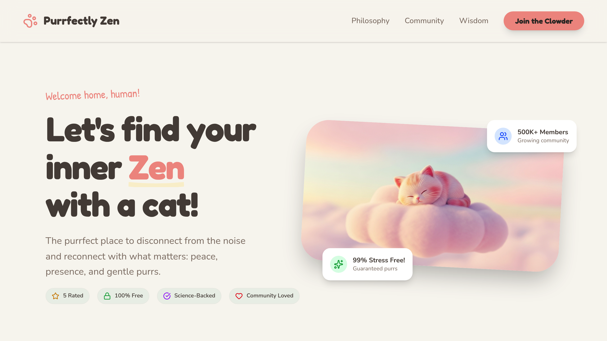

# 🐱 Purrfectly Zen Template

[](#purrfectly-zen)

> Find your zen. One breath, one paw print at a time.
>
> A cat-themed meditation and mindfulness web application designed to help you disconnect from noise and reconnect with what matters: peace, presence, and gentle purrs.

---

This project is a beautiful, interactive, and lightweight meditation app template built with **Astro**, **React**, and **Tailwind CSS**. It's designed for developers who want to jumpstart a mindfulness-focused project with a charming "cat-wisdom" aesthetic.

---

## ✨ Template Features

| Feature                     | Description                                                 |
| --------------------------- | ----------------------------------------------------------- |
| 🧘 **Guided Sessions**      | Interactive timer with customizable breathing animations.   |
| 🌬️ **Breathing Techniques** | Pre-configured 4-4-4-4 and "Purring Breath" patterns.       |
| 📱 **Astro Powered**        | Hybrid rendering for speed and SEO optimization.            |
| 🎨 **Design System**        | Warm, soft color palette with "Fredoka" and "Nunito" fonts. |
| ✨ **Micro-interactions**   | Smooth animations powered by Framer Motion.                 |
| 🆓 **Zero Backend**         | Pure client-side logic with `localStorage` persistence.     |

---

## 🚀 Technical Stack

- **Framework:** [Astro 5](https://astro.build/)
- **UI Library:** React (integrated via `@astrojs/react`)
- **Styling:** Tailwind CSS (v4 integration)
- **Animations:** Framer Motion
- **Icons:** Lucide React
- **Routing:** Built-in Astro file-based routing + client-side navigation

---

## 🛠️ Getting Started

### 1. Clone & Install

```bash
# Install dependencies
pnpm install # or npm install
```

### 2. Development

```bash
# Start the dev server
npm run dev
```

Visit `http://localhost:5000` to see the magic.

### 3. Build & Deploy

```bash
# Build for production
npm run build
```

---

## 📁 Project Structure

```
/src
├── components/   # React components (HomePage, ZenApp, etc.)
├── layouts/      # Astro layouts (Global styles & SEO)
├── lib/          # Utilities
└── pages/        # Astro routes
/public
└── images/       # Cat illustrations and portraits
```

---

## 🎨 Customization Tips

- **Branding:** Modify `src/layouts/Layout.astro` to change the CSS variables (`--primary`, `--background`) and update global SEO tags.
- **Content:** The main logic lives in `src/components/ZenApp.tsx`. You can easily add more breathing patterns or cat affirmations there.
- **Assets:** Swap out the images in `public/images/` to change the theme from cats to anything else (dogs, nature, etc.).

---

## 📝 License

[MIT](LICENSE) — Built for the community. Feel free to use, modify, and share.

Built with ❤️ and purrs. 🐾
